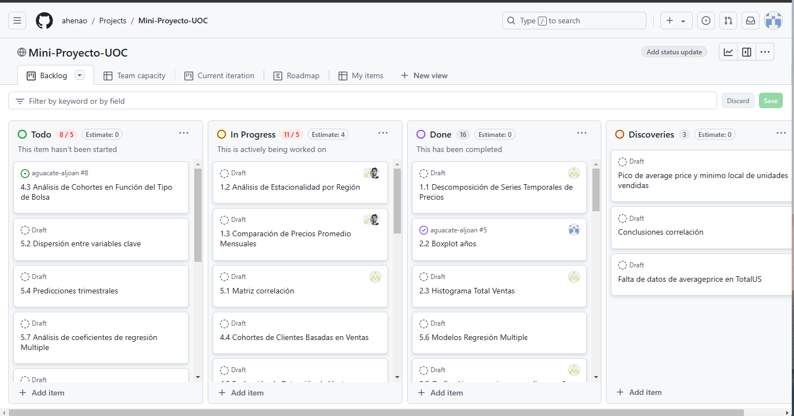
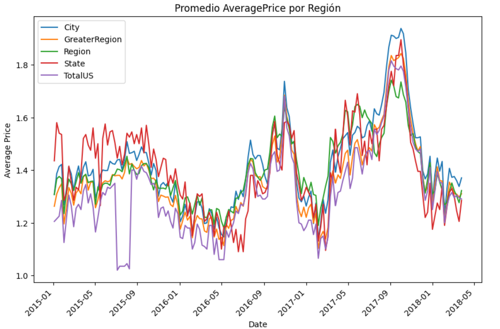
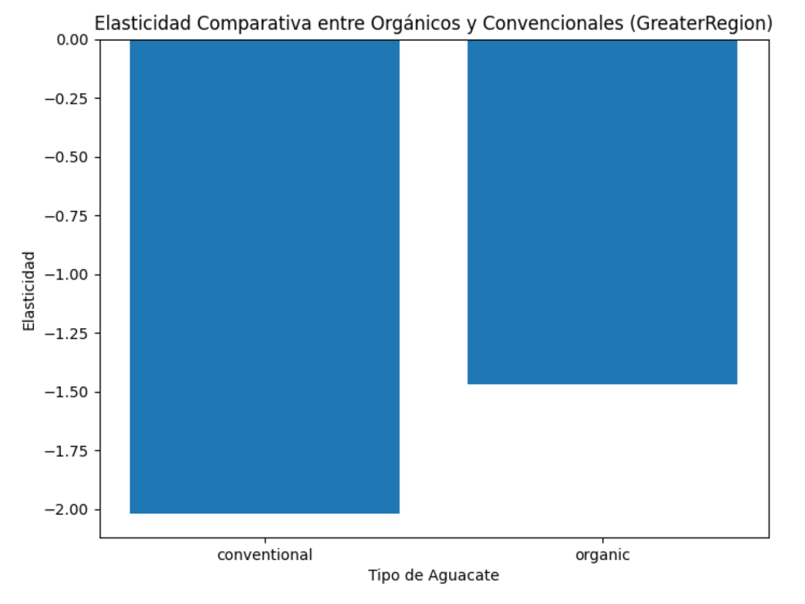

# aguacate-aljoan
Mini Proyecto UOC_1

Organizacion de equipo

1. Siempre se trabaja en su propia rama
2. Desde local se hace push a su propia rama
3. En github se verifica en la rama que este bien y se hace merge a la rama dev
4. Andres es el que hace los merge a main
5. Las tareas estan en el backlog, se asignan a uno y se ponen en in progress una vez que se comienza con ellas
6. Hacer commit con frecuencia de cambios, y push al menos una vez al día, o al terminar una tarea
7. Un jupyter por tarea/issue
8. Reuniones diarias para verificar avances y problemas

## Entorno de control de versiones y colaboración

Utilización de GitHub para el Control de Versiones definiendo una rama para cada participante de grupo, una rama de 'dev' y la rama 'main' como producción.


Utilización de GitHub Projects para la creación, asignación, ejecución y finalización de tareas (backlog). Columna especifica para Discoveries: información sobre investigaciones sobre los datos.



## utils

Función en data.py: obtener_nuevo_avocado() devuelve el nuevo dataframe con la clasificación de regiones, agrupaciones y ciudades

Para usar los módulos de utils en scripts se hace 
```
from utils.data import obtener_nuevo_avocado()
```
y para usarlos desde jupyter notebook, hay que agregar el path:

```
import sys, os
sys.path.append('../../../aguacate-aljoan/')  # Adjust to the path where utils is located
from utils.data import obtener_nuevo_avocado

nuevo__df = obtener_nuevo_avocado()
```
## Entorno de control de versiones y colaboración

Utilización de GitHub para el Control de Versiones definiendo una rama para cada participante de grupo, una rama de 'dev' y la rama 'main' como producción.


Utilización de GitHub Projects para la creación, asignación, ejecución y finalización de tareas (backlog). Columna especifica para Discoveries: información sobre investigaciones sobre los datos.


## Analisis e investigaciones de los datos en avocados.csv

La información en el archivo avocados.csvincluye los codigos de clasificación de aguacates usando codigos PLU (codigo de búsqueda de precio en íngles).

Estos codigos son de la variedad Hass:

- 4046 - Hass Small
- 4225 - Hass Large
- 4770 - Hass Extra Large

Existen codigos adicionales Hass:

- 94046 - Organic Hass Small
- 94225 - Organic Hass Large
- 94770 - Organic Hass Extra Large

Codigos de la variedad GEM:

- 3509 - variedad GEM de todos los tamaños
- 93509 -veriedad GEM organic de todos los tamaños

Codigos de la variedad Greenskins

- 4222 - Greenskin Small
- 94222 - Organic Greenskin Small
- 4224 - Greenskin Large
- 94224 - Organic Greenskin Large

Referencia:
<https://californiaavocado.com/retail/avocado-plus/#:~:text=PLU%20numbers%20are%20used%20to,the%20regular%20four%2Ddigit%20code>

El *avocado.csv* que estamos analizando solo incluye los codigos PLU Hass para avocado convencionales, aunque tiene otra columna de clasificación para avocado convencional y organico usando los mismo codigos.

Se puede observar en las columnas de datos:

|Date|AveragePrice|Total Volume|4046|4225|4770|Total Bags|Small Bags|Large Bags|XLarge Bags|type|year|region|region_type|
|-----|-----|-----|-----|-----|-----|-----|-----|-----|-----|-----|-----|-----|-----|
|2015-1-04|1.33|9213.49|3737.52|4327.52|0.00|1158.45|1158.45|0.00|0.0|organic|20150|Sacramento|City|
|....|....|....|....|....|....|....|....|....|....|....|....|....|....|

Según la documentación, Total Volume es el total de volumen de ventas de aguacates con los PLUs 4046, 4225 y 4770, pero con coinciden la suma de volumenes por PLU con Total Volume. Dado que hay mas tipos/PLUs, es posible que hay PLUs que cuentan para el Total Volume pero no se han incluido en el csv.

Otro punto de interes es que ciertas variedades, como el Hass, tienden a dar buenos rendimientos solo en años alternos. Después de una temporada con un bajo rendimiento, debido a factores como el frío (al cual el aguacate no tolera bien), los árboles tienden a producir abundantemente en la siguiente temporada. Esta cosecha abundante agota los carbohidratos almacenados, lo que resulta en un menor rendimiento en la siguiente temporada, y así se establece el patrón de alternancia en la producción.

Referencia:
<https://www.agmrc.org/commodities-products/fruits/avocados#:~:text=They%20are%20thought%20to%20have,followed%20by%20Florida%20and%20Hawaii>

Durante temporadas de bajo rendimiento de los arboles, se compensa la baja producción local (EE.UU) con las importaciones de aguacates procedentes de otros paises como Mejico.

En los datos de *avocado.csv*, se observa un incremento en los precios del aguacate durante el año 2017. Hemos intentado investigar las causas:

La volatilidad del mercado de aguacates en 2017 se debió a varios factores clave:

Alta demanda global: El consumo de aguacates aumentó significativamente en países como Estados Unidos, Europa y Asia.
Este “boom” del aguacate se debió a su popularidad en la gastronomía y su versatilidad en diferentes platos.

Problemas climáticos: En California, uno de los principales productores de aguacates, hubo una ola de calor que afectó la floración y redujo la producción a la mitad. Esto creó una escasez que elevó los precios.

Transición de cosechas: Hubo un período de transición entre la cosecha anterior y la nueva, lo que también contribuyó a la escasez temporal y al aumento de precios.

Dependencia de México: México es el mayor productor de aguacates del mundo, y cualquier interrupción en su suministro, ya sea por razones climáticas, huelgas o problemas logísticos, afecta significativamente el mercado global.

Estos factores combinados llevaron a una gran volatilidad en los precios del aguacate durante 2017, lo que se reflejó en los datos de ventas utilizados.

Referencia: <https://www.bbc.com/mundo/noticias-49209380>

## Análisis de Series

En el gráfico abajo, se puede observar el incremento del precio del aguacate durante el periodo 2017 debido a la volatilidad del mercado de agucates explicado



## Elasticidad

Sin embargo, la elasticidad volumen contra precio muestra que aguacates organicos (-1.5) es algo menos elástico comparado con aguacates convencionels (-2.5) a la demanda comparado con los convencionales:



### Interpretación de Valores de Elasticidad Negativa

Demanda Elástica: Si el valor de elasticidad es menor que -1 (por ejemplo, -1.5), la demanda se considera elástica, **lo que significa que un pequeño aumento en el precio conduce a una disminución proporcionalmente mayor en la cantidad demandada**. En este caso, los consumidores son relativamente sensibles a los cambios de precio.

Demanda Inelástica: Si el valor de elasticidad está entre 0 y -1 (por ejemplo, -0.5), la demanda es inelástica. Aquí, los cambios en el precio tienen un efecto menor en la cantidad demandada, lo que sugiere que los consumidores son menos sensibles a los cambios de precio para los aguacates.

Demanda Perfectamente Inelástica: Una elasticidad de 0 implicaría que la cantidad demandada no cambia independientemente de los cambios de precio, lo cual es raro para bienes como los aguacates.


