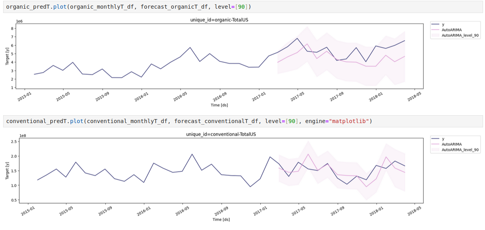
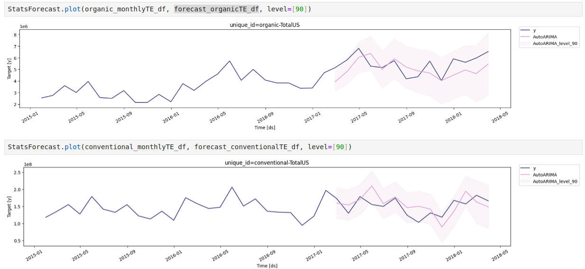

# aguacate-aljoan
Mini Proyecto UOC_1

Organizacion de equipo

1. Siempre se trabaja en su propia rama
2. Desde local se hace push a su propia rama
3. En github se verifica en la rama que este bien y se hace merge a la rama dev
4. Andres es el que hace los merge a main
5. Las tareas estan en el backlog, se asignan a uno y se ponen en in progress una vez que se comienza con ellas
6. Hacer commit con frecuencia de cambios, y push al menos una vez al día, o al terminar una tarea
7. Un jupyter por tarea/issue
8. Reuniones diarias para verificar avances y problemas

## utils

Función en data.py: obtener_nuevo_avocado() devuelve el nuevo dataframe con la clasificación de regiones, agrupaciones y ciudades

Para usar los módulos de utils en scripts se hace 
```
from utils.data import obtener_nuevo_avocado()
```
y para usarlos desde jupyter notebook, hay que agregar el path:

```
import sys, os
sys.path.append('../../../aguacate-aljoan/')  # Adjust to the path where utils is located
from utils.data import obtener_nuevo_avocado

nuevo__df = obtener_nuevo_avocado()
```
## Predicción mensual

Hemos usado una libreria opensource: [Nixtla/statsforecast](https://github.com/Nixtla/statsforecast) para realizar predicciones mensuales del dataset avocado.csv. 
Haciendo uso del modelo ARIMA (AutoRegressive Integrating MovingAverages) para predecir la variable **Total_Volume** para diferentes series agrupadas por tipo de aguacate (orgánico/convencional) y para regiones agrupadas:


La línea azul (y) representa los datos reales. realizamos un entrenamiento del modelo con datos del 2015.01 hasta 2017.07, y se realizaron predicciones desde 2017.08 hasta 2018.03 (para los cuales tenemos datos). Las predicciones junto a un intervalo de confianza del 90% se muestran en rosa. En algunos casos, las predicciones capturan las fluctuaciones (ver California), mientras en otros casos, sólo captura un rango de valores (que dentro del intervalo de confianza son acertados) sin más detalle en fluctuaciones inter-mensuales (ver SouthCentral). 

También realizamos predicciones mensuales para TotalUS (una sola serie temporal, en lugar de 8 en el caso de regiones agrupadas). La siguiente tabla resume el MAPE (Error Absoluto Medio Porcentual):

| Error MAPE| Valor [%] | 
|----------|----------|
| Orgánico por regiones     | 22.00 | 
| Convencional por regiones | 21.31 | 
| Orgánico TotalUS          | 22.35 | 
| Convencional TotalUS      | 21.77 | 

Lo que pudimos observar es que no hay gran diferencia para un modelo de regiones y otro de TotalUS respecto al error. Lo segundo, es que la precisión del modelo ARIMA para las predicciones hechas ronda el 20%. Aún hay márgen de mejora para las predicciones (Por ejemplo probar otros modelos de regresión, o incluir variables exógenas)

### Test con variable Exógena

En una predicción de series temporales pueden usarse variables exógenas como el clima, indicadores económicos, o eventos externos para ayudar a identificar tendencias de la variable a predecir. A continuación haremos un test en nuestras prediciones de la variable **Total_Volume**, esta vez usaremos la variable **AveragePrice** como variable exógena. Haremos predicciones de 15 meses a partir de 2017.02 (lo que incluye una región problemática por la variación de producción de aguacates por causas climáticas y otras varias). Este es un ejercicio teórico, ya que las variables exógenas también deben estar disponibles como predicción a futuro. Sería difícil predecir el precio del aguacate. Sin embargo, el precio si que podría estar ligado a su vez a otras variables exógenas típicas como lo son el clima, los indicadores económicos, etc (que tipicamente pueden encontrarse predicciones acertadas a cortos tiempos, por ejemplo ventana de semanas o máx. tres meses).
### Predicción sin variable exógena:


### Predicción con variable exógena:

